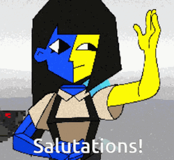

<!DOCTYPE html>
<html>
<head>
</head>

 
<h1 align = "center">Welcome to My Page</h1>

<table>

  <th>
  
  </th>

  <th>
  
Welcome to ClemTheAlien's Github! Enjoy your visit and consider looking at my stats and repos

  </th>
</table>

<table align = "center">
 
 <th>

 </th>

<th>

</th>

</table>

</html>
